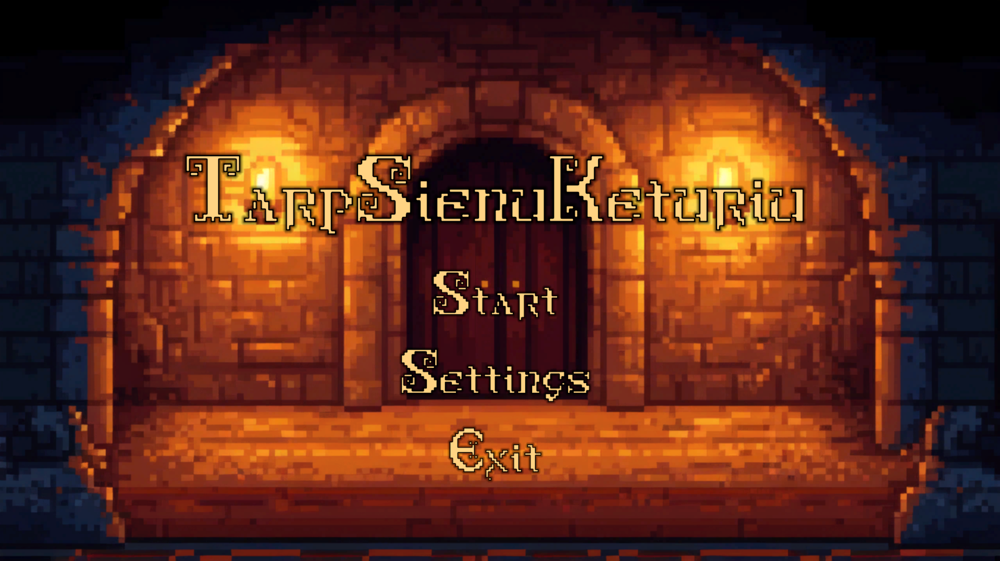

TarpKeturiuSienu

## Project Description

This project is a 2D roguelike adventure game developed in Unity. Players navigate through a pixel-art world, battling enemies, collecting items, and managing their health and inventory. The game features a top-down perspective and real-time combat.

**Key Features:**
*   **Player Movement:** Standard top-down movement with a dash ability.
*   **Combat:** Melee combat system using a sword. Players can attack in four directions.
*   **Health System:** Players have a heart-based health system. They can take damage, heal, and increase their maximum health.
*   **Enemy AI:** Enemies can detect and chase the player within a certain range. They have their own health and can drop items upon defeat.
*   **Inventory System:** Players can collect items, which are stored in an inventory. Some items are stackable.
*   **Items:**
    *   **Health Potion:** Restores player health.
    *   **HP Increasing Potion:** Increases the player's maximum health and heals them.
*   **Game UI:** Includes a health display (hearts), an inventory panel, and item pickup notifications.
*   **Menus:** Main menu, pause menu, and death menu.

**Technologies Used:**
*   **Unity Engine:** The primary game development platform.
*   **C#:** The programming language used for scripting game logic.
*   **Unity Input System:** Used for handling player input for movement and actions.

**Challenges & Future Features (Potential):**
*   **Challenge:** Implementing a robust and balanced combat system.
*   **Challenge:** Designing engaging levels and enemy encounters.
*   **Future Feature:** More diverse enemy types with unique behaviors.
*   **Future Feature:** Additional weapon types and special abilities.
*   **Future Feature:** Procedurally generated levels for increased replayability.
*   **Future Feature:** A more complex story or quest system.

## Table of Contents
* [Project Title](#project-title-roguelike-adventure-game)
* [Project Description](#project-description)
* [How to Install and Run the Project](#how-to-install-and-run-the-project)
* [How to Use the Project](#how-to-use-the-project)
* [Credits](#credits)
* [How to Contribute to the Project](#how-to-contribute-to-the-project)

## How to Install and Run the Project

1.  **Clone the repository (if applicable) or download the project files.**
2.  **Open the project in Unity Hub:**
    *   Ensure you have Unity Editor version `6000.0.40f1` installed.
    *   In Unity Hub, click "Add" and navigate to the project's root folder.
3.  **Open the project from Unity Hub.**
4.  **Locate the main game scene:** This is typically found in the `Assets/Scenes/` folder. Look for a scene named something like "MainLevel", "Game", or the first scene in the build settings.
5.  **Press the Play button in the Unity Editor** to run the game.

**Dependencies:**
*   Unity Editor `6000.0.40f1`.
*   Unity Input System package (should be listed in `Packages/manifest.json`).

## How to Use the Project

**Controls (Default - may vary based on Input Actions configuration):**
*   **Movement:** Arrow Keys or WASD (configurable via Unity Input System).
*   **Dash:** Left Shift (configurable).
*   **Attack:** (Configurable, e.g., Spacebar, Left Mouse Button).
*   **Open Inventory:** (Configurable, e.g., 'I' or 'Tab').
*   **Pause Game:** Escape (configurable).

**Gameplay:**
*   Explore the game world.
*   Engage enemies in combat using your sword.
*   Collect items dropped by enemies or found in the environment.
*   Use potions to heal or increase your maximum health.
*   Manage your inventory to keep useful items.
*   If your health drops to zero, the game will end, and a death menu will appear.

## Credits

*   **Developers:**
    *   Konradas Šapranauskas
    *   Mantas Blažauskas
    *   Edvinas Aleksandravičius
    *   Jonas Kasiliauskas

## How to Contribute to the Project

(This section is primarily for open-source projects.)

If you'd like to contribute:
1.  Fork the Project.
2.  Create your Feature Branch (`git checkout -b feature/AmazingFeature`).
3.  Commit your Changes (`git commit -m 'Add some AmazingFeature'`).
4.  Push to the Branch (`git push origin feature/AmazingFeature`).
5.  Open a Pull Request.

Please ensure your code adheres to the existing coding style and that any new features are well-documented.
